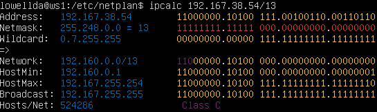

# Отчёт

## Part 1. Инструмент **ipcalc**

#### 1.1. Сети и маски

##### Определить и записать в отчёт:
##### 1) Адрес сети *192.167.38.54/13*

##### 2) Перевод маски *255.255.255.0* в префиксную и двоичную запись, */15* в обычную и двоичную, *11111111.11111111.11111111.11110000* в обычную и префиксную

##### 255.255.255.0
Двоичная: 11111111.11111111.11111111.0000000
Префиксная: /24

##### /15
Обычная: 255.254.0.0
Двоичная: 11111111.11111110.00000000.00000000

##### 11111111.11111111.11111111.11110000
Обычная: 255.255.255.240
Префиксная: /28

#### 1.2. localhost

##### 127.0.0.2
.png)

##### 127.1.0.1
.png)

#### 1.3. Диапазоны и сегменты сетей
##### Частные "серые" IP-адреса
* От 10.0.0.0 до 10.255.255.255 с маской 255.0.0.0 или /8
* От 172.16.0.0 до 172.31.255.255 с маской 255.240.0.0 или /12
* От 192.168.0.0 до 192.168.255.255 с маской 255.255.0.0 или /16
* От 100.64.0.0 до 100.127.255.255 с маской подсети 255.192.0.0 или /10; данная подсеть рекомендована согласно rfc6598 для использования в качестве адресов для CGN (Carrier-Grade NAT)

##### Определить и записать в отчёт:
##### 1) какие из перечисленных IP можно использовать в качестве публичного, а какие только в качестве частных:

* 10.0.0.45 - частный
* 134.43.0.2 - публичный
* 192.168.4.2 - частный
* 172.20.250.4 - частный
* 172.0.2.1 - публичный
* 192.172.0.1 - публичный
* 172.68.0.2 - публичный
* 172.16.255.255 - частный
* 10.10.10.10 - частный
* 192.169.168.1 - публичный

##### 2) какие из перечисленных IP адресов шлюза возможны у сети *10.10.0.0/18*:

Обычно должен стоять адресс шлюза у которого в несетевой части стоит 1, но фактически может быть любой другой адрес в машинной части.

Шлюзы: 10.10.0.2, 10.10.10.10, 10.10.1.255

## Part 2. Статическая маршрутизация между двумя машинами

##### С помощью команды `ip a` посмотреть существующие сетевые интерфейсы

##### ws1
.png)

##### ws2
.png)

##### Описать сетевой интерфейс, соответствующий внутренней сети, на обеих машинах и задать следующие адреса и маски: ws1 - *192.168.100.10*, маска */16*, ws2 - *172.24.116.8*, маска */12*

##### ws1
.png)

##### ws2
.png)

##### Выполнить команду `netplan apply` для перезапуска сервиса сети

##### ws1
.png)

##### ws2
.png)

#### 2.1. Добавление статического маршрута вручную
##### Добавить статический маршрут от одной машины до другой и обратно при помощи команды вида `ip r add`

##### Пропинговать соединение между машинами

##### ws1
.png)

##### ws2
.png)

#### 2.2. Добавление статического маршрута с сохранением
##### Перезапустить машины
##### Добавить статический маршрут от одной машины до другой с помощью файла *etc/netplan/00-installer-config.yaml*
##### Пропинговать соединение между машинами

##### ws1
.png)

##### ws2
.png)

## Part 3. Утилита **iperf3**

#### 3.1. Скорость соединения
##### Перевести и записать в отчёт: 8 Mbps в MB/s, 100 MB/s в Kbps, 1 Gbps в Mbps

8 Mbps = 1 MB/s
100 MB/s = 80 000 Kbps
1 Gbps = 1000 Mbps

#### 3.2. Утилита **iperf3**
##### Измерить скорость соединения между ws1 и ws2

##### (Слева - ws1; Справа - ws2)
.png)

## Part 4. Сетевой экран

#### 4.1. Утилита **iptables**
##### Создать файл */etc/firewall.sh*, имитирующий фаерволл, на ws1 и ws2:
##### Нужно добавить в файл подряд следующие правила:
##### 1) на ws1 применить стратегию когда в начале пишется запрещающее правило, а в конце пишется разрешающее правило (это касается пунктов 4 и 5)

##### 2) на ws2 применить стратегию когда в начале пишется разрешающее правило, а в конце пишется запрещающее правило (это касается пунктов 4 и 5)
##### 3) открыть на машинах доступ для порта 22 (ssh) и порта 80 (http)
##### 4) запретить *echo reply* (машина не должна "пинговаться”, т.е. должна быть блокировка на OUTPUT)
##### 5) разрешить *echo reply* (машина должна "пинговаться")

## Part 5. Статическая маршрутизация сети

#### 5.1. Настройка адресов машин
##### Настроить конфигурации машин в *etc/netplan/00-installer-config.yaml* согласно сети на рисунке.

##### ws11
.png)

##### ws21
.png)

##### ws22
.png)

##### r1
.png)

##### r2
.png)

##### Перезапустить сервис сети. Если ошибок нет, то командой `ip -4 a` проверить, что адрес машины задан верно. Также пропинговать ws22 с ws21. Аналогично пропинговать r1 с ws11.

##### ws11
.png)

##### ws21
.png)

##### ws22
.png)

##### r1
.png)

##### r2
.png)

#### 5.2. Включение переадресации IP-адресов.
##### Для включения переадресации IP, выполните команду на роутерах: sysctl -w net.ipv4.ip_forward=1

.png) .png)

##### Откройте файл */etc/sysctl.conf* и добавьте в него следующую строку: `net.ipv4.ip_forward = 1`

.png)

.png)

#### 5.3. Установка маршрута по-умолчанию

__Настроить маршрут по-умолчанию (шлюз) для рабочих станций. Для этого добавить default перед IP роутера в файле конфигураций__

.png) .png) .png)

__Вызвать ip r и показать, что добавился маршрут в таблицу маршрутизации__

.png)

__Пропинговать с ws11 роутер r2 и показать на r2, что пинг доходит. Для этого использовать команду:__  `tcpdump -tn -i eth1`

.png) .png)

#### 5.4. Добавление статических маршрутов

__Добавить в роутеры r1 и r2 статические маршруты в файле конфигураций__

.png) .png)

__Вызвать ip r и показать таблицы с маршрутами на обоих роутерах__

.png) .png)

__Запустить команды на ws11: ip r list 10.10.0.0/[маска сети] и ip r list 0.0.0.0/0__

Это зависит от длины префикса или количества бит, установленного в маске подсети. При переадресации пакета более длинным префиксам всегда отдается предпочтение над короткими.

.png)

#### 5.5. Построение списка маршрутизаторов

Traceroute — это утилита, которая позволяет проследить маршрут следования данных до удалённого адресата в сетях TCP/IP.

Утилита Traceroute формирует UDP-датаграмму (сообщение, которое нужно доставить целевому серверу), упаковывает её в IP-пакет и передаёт первому транзитному узлу. В заголовке такого IP-пакета есть поле TTL (Time To Live) — время жизни пакета. Оно определяет количество хопов, через которые пакет может пройти. На каждом узле TTL уменьшается на единицу. Если на пути к удалённому адресату время жизни пакета станет равно 0, маршрутизатор отбросит пакет и отправит источнику ICMP-сообщение об ошибке «Time Exceeded» (время истекло).

Tracert отправляет на хост назначения ICPM-запрос «Echo Request» с TTL=1. Первый маршрутизатор, который получит запрос, проверяет, кому он предназначен. Если маршрутизатор не является целевым хостом, он уменьшает TTL на 1, отбрасывает пакет и отправляет ICMP-сообщение источнику, так как время жизни теперь равно 0. В этом сообщении маршрутизатор указывает информацию о себе и причину дропа пакета. Получив сообщение, Tracert запоминает этот маршрутизатор как первый хоп (прыжок) и отправляет следующий пакет, но уже с TTL=2. Первый хоп успешно обрабатывает новый пакет, уменьшает время его жизни на 1 и передаёт дальше. Следующий маршрутизатор тоже выполняет проверку хоста назначения и, если пакет предназначен не ему, уменьшает TTL, отбрасывает пакет и отправляет ICMP-сообщение источнику. Tracert запоминает второй хоп, снова увеличивает TTL на 1 и отправляет следующий пакет. Эти действия будут повторяться до тех пор, пока пакет не достигнет целевого хоста. Когда запрос попадёт к целевому хосту, этот хост в ответ направит ICMP «Echo Reply». Источник воспримет это как завершение трассировки.

.png)

__При помощи утилиты traceroute построить список маршрутизаторов на пути от ws11 до ws21__

.png)

Traceroute основана на отправке udp фрагментов и получения сообщения о доступности/недостижимости порта. Host генерирует udp фрагмент, инкапсулирует его в IP пакет и выставляет ttl=1. r1, являясь транзитным узлом, ответит на данный пакет icmp сообщением об окончании времени жизни пакета. Утилита traceroute, получив данное сообщение, указывает адрес источника icmp пакета (r1) как адрес первого хопа. Далее процесс повторяется с инкрементированием ttl пакета. В udp заголовке есть поля source и destination порт. Source порт будет любым портом выше 1023. Работа утилиты traceroute основана на получении сообщения о недостижимости или доступности порта назначения. То есть мы отправляем udp фрагмент с порта 52203 на порт 33445. ws21 является узлом назначения. Получив пакет, он распаковывает его и должен передать его протоколам высшего уровня. Но так как порт 33445 по умолчанию будет закрыт на сервере, то ws21 формирует icmp сообщение о недостижимости порта назначения (ICMP Type 3 «Destination Unreachable» Code 3 «Port Unreachable»). Получив данное сообщение, утилита traceroute считает трассировку законченной.

#### 5.6. Использование протокола ICMP при маршрутизации

__Запустить на r1 перехват сетевого трафика, проходящего через eth0 с помощью команды:__

`tcpdump -n -i eth0 icmp`

.png)

__Пропинговать с ws11 несуществующий IP (например, 10.30.0.111) с помощью команды:__

`ping -c 1 10.30.0.111`

.png)

## Part 6. Динамическая настройка IP с помощью DHCP

__Для r2 настроить в файле /etc/dhcp/dhcpd.conf конфигурацию службы DHCP:__

__1) указать адрес маршрутизатора по-умолчанию, DNS-сервер и адрес внутренней сети__

.png)

__2) в файле resolv.conf прописать nameserver 8.8.8.8.__

.png)

__Перезагрузить службу DHCP командой systemctl restart isc-dhcp-server. Машину ws21 перезагрузить при помощи reboot и через ip a показать, что она получила адрес. Также пропинговать ws22 с ws21.__

.png) 

.png)

__Указать MAC адрес у ws11, для этого в etc/netplan/00-installer-config.yaml надо добавить строки: macaddress: 10:10:10:10:10:BA, dhcp4: true__

.png)

__Для r1 настроить в файле /etc/dhcp/dhcpd.conf конфигурацию службы DHCP:__

__1) указать адрес маршрутизатора по-умолчанию, DNS-сервер и адрес внутренней сети__

.png)

__2) в файле resolv.conf прописать nameserver 8.8.8.8.__

.png)

__Перезагрузить службу DHCP командой systemctl restart isc-dhcp-server__

.png)

__Запросить с ws21 обновление ip адреса__

Перед запросом обновления ip адреса использую команду `sudo dhclient -r` для удаления старого ip адреса, после чего использую команду `sudo dhclient` для запроса нового ip адреса

.png)

## Part 7. NAT

__В файле /etc/apache2/ports.conf на ws22 и r1 изменить строку Listen 80 на Listen 0.0.0.0:80, то есть сделать сервер Apache2 общедоступным__

.png) .png)

__Запустить веб-сервер Apache командой service apache2 start на ws22 и r1__

.png) .png)

__Добавить в фаервол, созданный по аналогии с фаерволом из Части 4, на r2 следующие правила:__

Создаю firewall на r2 и прописываю туда правила `- iptables -F, iptables -F -t nat, iptables --policy FORWARD DROP`

.png)

Запуск файла командами `chmod +x /etc/firewall.sh` и `/etc/firewall.sh` на r2

.png)

Проверка соединения между ws22 и r1 командой ping

.png)

Добавил правило, разрешающее маршрутизации пакетов протокола ICMP

.png)

Новая проверка соединения между ws22 и r1 командой `ping`

.png)

__Добавить в файл ещё два правила:__

1. Включить SNAT, а именно маскирование всех локальных ip из локальной сети, находящейся за r2

2. Включить DNAT на 8080 порт машины r2 и добавить к веб-серверу Apache, запущенному на ws22, доступ извне сети

.png)

Проверить соединение по TCP для SNAT, для этого с ws22 подключиться к серверу Apache на r1 командой: `telnet [адрес] [порт]`

.png)

Проверить соединение по TCP для DNAT, для этого с r1 подключиться к серверу Apache на ws22 командой `telnet`

.png)

## Part 8. Дополнительно. Знакомство с SSH Tunnels

__Запустить на r2 фаервол с правилами из Части 7__

.png)

__Запустить веб-сервер Apache на ws22 только на localhost (то есть в файле /etc/apache2/ports.conf изменить строку Listen 80 на Listen localhost:80)__

.png) .png)

Использую Local TCP forwarding с ws21 до ws22, для этого применяю команду `ssh -L 8888:10.20.0.20:80 lowellda@localhost`

.png)

Для проверки подключения перехожу на второй терминал и использую команду `telnet 127.0.0.1 80`

.png)

Использую Remote TCP forwarding с ws11 до ws22, для этого применяю команду `ssh -R 8888:10.20.0.20:80 lowellda@localhost`

.png)

Для проверки подключения перехожу на второй терминал и использую команду `telnet 127.0.0.1 80`

.png)
